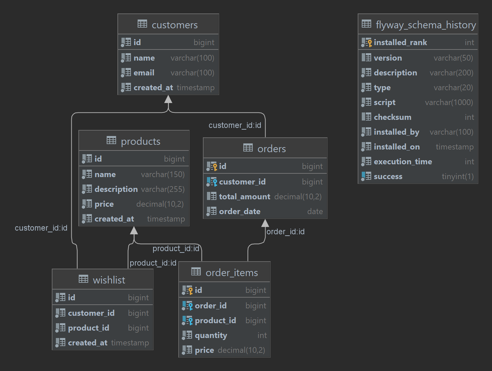

# E-commerce Application

## Overview
This is a Spring Boot based e-commerce backend application that manages customers, products, orders, and wishlists with sales analytics features. It supports different profiles for development and production environments, including Docker-based deployment and ELK stack integration for logging.

## Project Structure
```
src/main/java/com/wsd/ecommerce/          — Main source code
    config/                               — Application configuration classes (e.g., SwaggerConfig)
    controller/api/v1/                    — REST API controllers
    dto/                                 — Data Transfer Objects
    entity/                              — JPA entities
    exception/                           — Custom exceptions and handlers
    helper/                              — Helper classes
    repository/                         — Spring Data JPA repositories
    service/                            — Service interfaces
    service/impl/                      — Service implementations

src/main/resources/                      — Resources and configuration
    application.properties              — Default Spring Boot properties
    application-dev.properties          — Development profile properties
    application-prod.properties         — Production profile properties
    logback-spring.xml                  — Logging configuration for Spring Boot
    db/migration/                       — Flyway database migration scripts
        V1__create_table.sql            — Initial table creation
        V2__insert_init_data.sql        — Seed initial data

logstash.conf                           — Logstash configuration file for ELK stack ingestion
docker-compose.yml                      — Docker compose configuration for development and production
Dockerfile                             — Dockerfile to build application container image
pom.xml                               — Maven build configuration
.gitignore                            — Git ignore rules
```

## Database

The application uses a relational database managed via **Flyway** migrations.

- **Schema Initialization**:  
  Handled via migration script `V1__create_table.sql`, which creates tables for:
    - `customers`
    - `products`
    - `orders`
    - `order_items`
    - `wishlist`

- **Initial Data Seeding**:  
  Done using `V2__insert_init_data.sql`, which populates:
    - Sample customers
    - Sample products
    - Sample orders and order items
    - Wishlist entries

This ensures that the application is ready to run with basic data for testing and development.

### ER Diagram



## Getting Started

### Development Mode
Uses the dev Spring profile with development database in Docker.

Run:
```bash
docker-compose --profile dev up -d
```
Access the app at: [http://localhost:8081](http://localhost:8081)

Swagger UI: http://localhost:8081/swagger-ui.html

### Production Mode
Uses the prod profile with production database and ELK stack logging.

Build and run:
```bash
docker-compose --profile prod up --build
```

Access the app at: [http://localhost:8080](http://localhost:8080)

Swagger UI: http://localhost:8080/swagger-ui.html

## Features

### Functional Features
- Manage customer wishlists
- Track daily sales and order details
- Retrieve sales analytics:
    - Total sales amount for the current day
    - Max sale day within a date range
    - Top 5 selling items of all time by sales amount
    - Top 5 selling items of last month by number of sales

### Non-Functional Features
- Proper layered architecture and clean code structure
- Initial database seeding using Flyway migrations
- Centralized logging with ELK stack (Elasticsearch, Logstash, Kibana)
- Dockerized for portability and ease of deployment
- REST API documentation with Swagger UI
- Git version control with proper commit practices
- Comprehensive unit and integration tests

## Logging
Application logs are managed with Logback and sent to ELK stack in production profile.

Logstash is configured via `logstash.conf` to ingest logs into Elasticsearch.

Logs are available under `logs/` directory during development.

## Viewing Logs in Kibana

### Access Kibana UI
Open Kibana in your browser (default port is usually 5601):
```bash
http://localhost:5601
```

### Configure the Index Pattern
- Navigate to Management > Stack Management > Index Patterns.
- Create a new index pattern that matches your Elasticsearch log indices (e.g., `ecommerce-app-*`).
- Set the timestamp field (e.g., `@timestamp`) for time-based log querying.

### Explore Logs
- Go to Discover in Kibana.
- Select the configured index pattern.
- Use filters and time range selectors to search and analyze your application logs in real time.

### Dashboard and Visualization (Optional)
Build dashboards to visualize log metrics, error rates, or other relevant data based on your logging setup.

## Testing
Unit and integration tests available under `src/test/java`.

Run tests with Maven:
```bash
./mvnw test
```

##Future Modifications for Scalability, Availability & Fault Tolerance

To enhance scalability and fault tolerance, the current monolithic application can be migrated to a microservices-based architecture with the following components:

### API Gateway
Single entry point for clients (e.g., Spring Cloud Gateway, Zuul, or NGINX).

Handles routing, authentication, and rate limiting.

### Service Registry
Use Eureka, Consul, or Zookeeper for service discovery.

### Microservices
Split monolithic services (Wishlist, SalesAnalytics, Orders, Products) into independent microservices.

Communicate via REST or gRPC.

### Centralized Configuration
Spring Cloud Config Server backed by Git repo or Consul.

Ensures all services load configs dynamically without redeployment.

### Circuit Breaker & Resilience
Implement Resilience4j or Hystrix for fault tolerance.

Add fallback and retry policies.

### Message Broker
Apache Kafka for asynchronous event-driven communication.

Enables scalability and decoupling between services.

### Caching Layer
Redis for distributed caching and session management.

### Logging & Monitoring

Prometheus + Grafana for metrics and monitoring.

### Container Orchestration
Kubernetes (K8s) for auto-scaling, fault tolerance, and high availability.

Deploy microservices as Docker containers.


## Contribution & Version Control
Follow Git best practices for branching, committing, and pull requests.

`.gitignore` excludes IDE files, build artifacts, and local environment files.

## Contact
For questions or contributions, please open an issue or submit a pull request.
